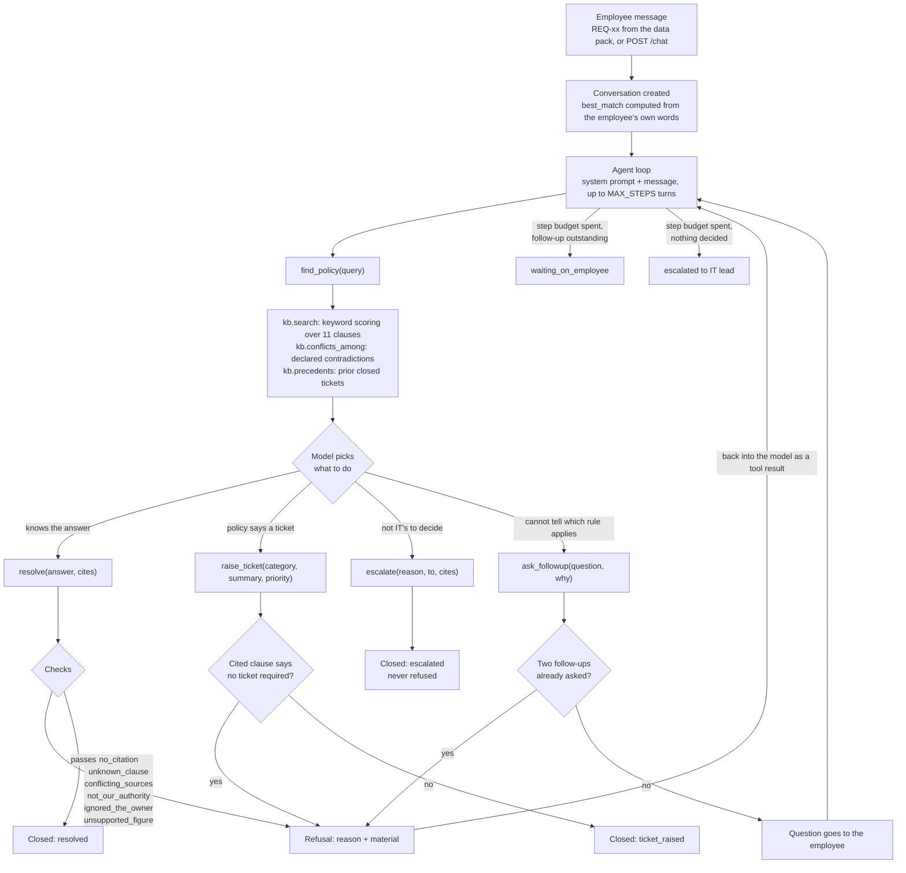

# Architecture and process flow

## The claim this design is built around

The guarantees live in `backend/app/tools.py` as functions that return errors, not in
`backend/prompts/agent.md` as instructions. A prompt is a request. A function signature
is a rule.

This matters because the two things fail differently. If the prompt says "always
cite your source" and the model does not, nothing happens: the answer goes out
uncited and looks exactly like a good one. If `resolve()` requires a non-empty
`cites` list and checks every id against the knowledge base, the uncited answer
cannot leave the process. It comes back as `{"refused": "no_citation"}` with an
instruction to fix it, and the model tries again.

So the prompt and the tools say overlapping things on purpose, and they are not
doing the same job. The prompt raises the chance the model gets it right the
first time, which saves a round trip. The tools decide what is actually allowed
out. Deleting the prompt would make the agent slower and clumsier. Deleting the
checks in `tools.py` would make it unsafe.

## Layers

```
backend/app/main.py     HTTP. Streams the run as server-sent events. Holds session state.
backend/app/agent.py    The loop. Tool schemas, step budget, event emission.
backend/app/tools.py    The five tools and their refusals. The rules live here.
backend/app/kb.py       Retrieval, declared conflicts, precedent lookup.
backend/data/*.yaml     The supplied data pack, transcribed.
backend/prompts/agent.md The system prompt, formatted per request.
backend/app/llm.py      Which model answers. One env var.
```

They are separated along one line: **what a model can influence, and what it
cannot.**

The model can influence everything in `agent.py` and above — which tool it
calls, in what order, with what arguments, and what words go to the employee.
That is the part that has to be flexible, because the right sequence of steps
for a request is not knowable before you read the request.

The model cannot influence anything in `tools.py` and below. It cannot reach
`kb.CLAUSES` except through `find_policy`. It cannot close a request except
through `resolve`, `raise_ticket` or `escalate`. It cannot mark a conflict as
resolved, because conflicts are declared in `backend/data/knowledge_base.yaml` and
checked in code.

Two smaller separations follow from that:

**`kb.py` is the only door to policy text.** Nothing else reads
`backend/data/knowledge_base.yaml`. That is what makes "the agent shows the source it
used" a property of the system and not a habit of the prompt — there is no path
by which policy text reaches an answer without passing through a clause with an
id.

**`llm.py` is one file because the agent must not depend on a vendor.** Tool
calling is the only model capability the design uses, and Groq, Gemini and
OpenAI all have it. Swapping providers is an env var, not a refactor.

## A request's path



The refusal edge is the one to watch. A refusal is not an exception and not a
failure — it is a `ToolMessage` containing the reason and, where it helps, the
clauses involved. The model reads it on the next turn and corrects. REQ-01 is
the clearest case: the agent retrieves KB-03 and ASSET-01, tries to resolve from
KB-03, gets `conflicting_sources` back with both clauses attached, and escalates
with both. Nothing about that sequence was scripted.

## The five tools, and what each refuses

| Tool | Refuses when | Why that refusal exists |
| --- | --- | --- |
| `find_policy` | never | It is a read. Refusing a search teaches nothing. |
| `ask_followup` | two questions already asked (`followup_budget_spent`) | An employee who wanted a form would have filled one in. Past the budget the agent has to act on what it has or hand over. |
| `resolve` | `no_citation`, `unknown_clause`, `conflicting_sources`, `not_our_authority`, `ignored_the_owner`, `unsupported_figure` | This is where an answer leaves the building. Everything that must be true of an answer is checked here. |
| `raise_ticket` | a retrieved clause says no ticket is required (`no_ticket_needed`); priority outside low/normal/high/urgent (`bad_priority`) | The fastest service desk is the one that does not open work it does not have to. KB-07 guest Wi-Fi is the case. |
| `escalate` | never | Escalating when it was unnecessary costs somebody a minute. Not escalating when it was necessary costs an approval nobody authorised. |

Three of `resolve`'s checks are worth explaining, because each closes a loophole
found by running the thing rather than by reasoning about it.

**`conflicting_sources` runs over everything retrieved, not just what the answer
cited.** Otherwise a contradiction is dodged by citing one side of it. That
answer looks properly sourced and is still wrong, which makes it the hardest
kind to catch when a human reviews the transcript.

**`ignored_the_owner` is grounded in the employee's words, not the agent's
query.** `Conversation.best_match` is computed once, at creation, from the text
the employee wrote. It exists because a model that wants a particular answer
writes the query that finds it: asked about the expense tool, the agent searched
"expense tool login invalid credentials password reset policy", floated the
password clause to the top, and answered from that — while KB-08 sat there
saying the whole thing belongs to Finance. The model can steer `find_policy`. It
cannot steer what the employee typed.

**`unsupported_figure` catches thresholds specifically.** The way a model
invents policy is not to make up a rule from nothing; it is to keep the shape of
the real rule and change the number. So the check extracts number-and-unit pairs
from the answer and from the cited clause text, and refuses any figure in the
answer that appears in none of them. It is a regex, and it is deliberately
strict — see the known false positive in
[`assumptions.md`](assumptions.md#known-rough-edges).

## Why the HTTP layer streams

`POST /requests/{id}/run` and `POST /chat` return server-sent events, not JSON.

A request takes several seconds and then produces an answer. Returned as JSON,
that is a slow chatbot and you have to take the guarantees on faith. Streamed,
the same seconds show the search, the clauses found, the refusal, and the
correction, in the order they happened. It is the only honest way to show that
the checks in `tools.py` are real rather than claimed, which is most of what the
demo has to do.

Mechanically: `agent.run()` is synchronous and blocking, so `_stream()` in
`main.py` runs it on a worker thread via `asyncio.to_thread` while the coroutine
drains an `asyncio.Queue` the thread writes into with
`loop.call_soon_threadsafe`. The `X-Accel-Buffering: no` header is there because
proxies buffer by default, which would turn a live trace back into one late
blob.

The event types are `start`, `say`, `tool_start`, `tool_result`, `refused`,
`outcome`, `error`, `done`. `refused` is its own event rather than a variety of
`tool_result` because it is the interesting one: it is the moment a tool stopped
the model doing something.

## State and the audit trail

A `Conversation` is the audit trail. It holds the employee's text, the clauses
cited across the whole run, every successful tool call with a UTC timestamp, the
turns shown to the employee, and the outcome. `GET /requests/{id}` returns it.

One thing to know when reading it: `convo.actions` records tool calls that
**succeeded**. A refusal returns before it logs, so refusals appear in the live
event stream and not in the stored trail. That is a gap. Persisting refusals
into `actions` is the first change I would make to this file if the audit trail
had to stand on its own without someone watching the stream.

Session state lives in the `CONVERSATIONS` dict in `main.py`, in memory, and the
reasoning for that is in [`assumptions.md`](assumptions.md#state).

## Reading order

If you have ten minutes and want to understand this, read in this order:

1. `backend/app/tools.py` — the module docstring, then `resolve`. Everything else is plumbing around these.
2. `backend/app/kb.py` — why retrieval is keyword scoring and why conflicts are declared in data.
3. `backend/app/agent.py` — the loop, and what happens to a refusal.
4. `backend/prompts/agent.md` — the instructions, which the tools do not trust.
