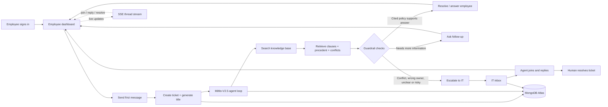

# Veridian IT Desk — simple process flow

This is the diagram to use in the submission, slides, and the first two minutes
of the demo. It intentionally shows the happy path and the two important
guardrail outcomes: **resolve safely** or **hand off to a human**.



## One-sentence explanation

> The employee message creates a persisted ticket, MiMo searches only the
> supplied knowledge base through controlled tools, and the system either
> returns a cited answer, asks a bounded follow-up, or routes the ticket to IT
> without inventing policy.

## Dashboard roles

| Role | Main view | Capabilities |
| --- | --- | --- |
| Employee | Help / ticket workspace | Create tickets, chat with the agent, see status and human replies |
| IT support | Inbox / conversation workspace | Filter tickets, join, reply, take ownership, resolve |
| Admin | Inbox + Manage KB + Team | Everything IT support can do plus KB and user management |

## Important state transitions

```text
new ticket
  -> open / AI working
  -> waiting on employee       (agent asked a follow-up)
  -> resolved by AI            (safe, cited answer)
  -> escalated / waiting for IT (policy conflict, unclear or risky)
  -> assigned to IT            (human joins)
  -> resolved by human
```

An employee message after an AI resolution reopens the AI flow. An employee
message after a human resolution reopens the IT handoff flow. Once a human has
joined, employee messages are delivered to the human and do not start another
AI response.
